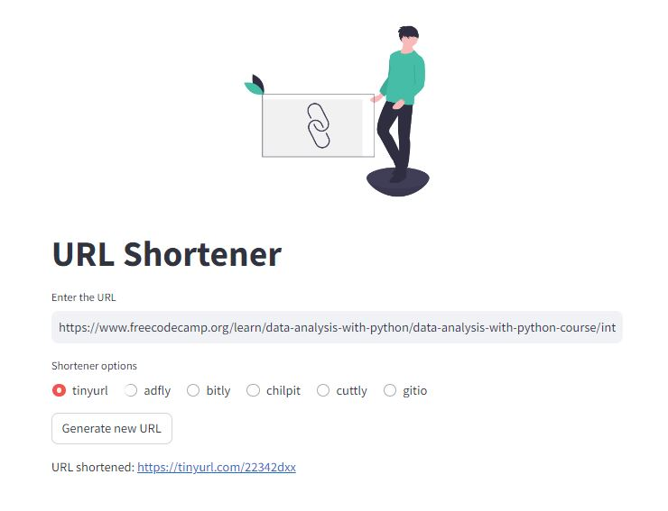

# Shortcut

URL shortener 🪓

Make sure to install [@streamlit](https://streamlit.io/#install).

## Technologies

[](https://skillicons.dev)

[](https://choosealicense.com/licenses/mit/)
[](https://github.com/EmanuelCG/short-url.git "Go to GitHub repo")

## Screenshots



## Installation

1. Clone the repository:

    ```bash
    git clone https://github.com/EmanuelCG/short-url.git
    ```

2. Navigate to the project directory:

    ```bash
    cd your_project
    ```

3. Install dependencies:

    ```bash
    pip install -r requirements.txt
    ```

## Usage

1. Set up your virtual environment and activate it.
2. Run the development server:

    ```bash
    streamlit run short.py
    ```

3. Open your web browser and visit `http://localhost:8000` to see the application in action.

## Contribution

If you want to contribute to this project, follow these steps:

1. Fork the project.
2. Create a new branch (`git checkout -b feature/new-feature`).
3. Make your changes and commit (`git commit -am 'Add a new feature'`).
4. Push to the branch (`git push origin feature/new-feature`).
5. Create a pull request.
